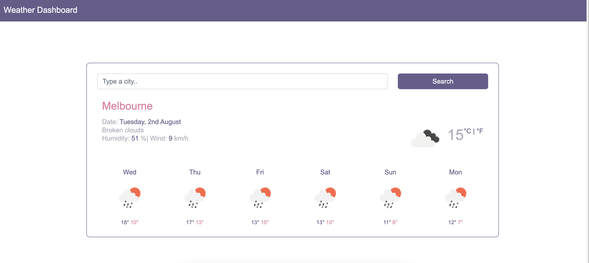

# Weather-Dashboard

## Description

This week's challenge was to build a weather dashboard that will run in the browser and feature dynamically updated HTML and CSS.

This challenge uses OpenWeather One Call API (Links to an external site.) to retrieve weather data for cities and localStorage needs to be used to store any persistent data.

The main acceptance criteria were as follow:

- When I search for a city then I am presented with current and future conditions for that city and that city is added to the search history
- When I view current weather conditions for that city then I am presented with the city name, the date, an icon representation of weather conditions, the temperature, the humidity, the wind speed, and the UV index
- When I view the UV index then I am presented with a color that indicates whether the conditions are favorable, moderate, or severe
- When I view future weather conditions for that city then I am presented with a 5-day forecast that displays the date, an icon representation of weather conditions, the temperature, the wind speed, and the humidity
- When I click on a city in the search history then I am again presented with current and future conditions for that city

## What I learned

For this challenge I have learned how to retrieve the OpenWeather API and how to dynamically display them using Javascript. This was a little time consuming but fetching the data from the API was not difficult. Once you read the documentation from the API and you do a few tests to check how the responses work it is not challenging to dynamically display the current weather and the forecast.

## Challenges

The main challenge for this project was to save the searches in the local storage and to create the buttons with the correct city weather displaying once you click on them.

### Link to deployed page

https://appolinefr.github.io/Weather-Dashboard/

#### Screenshot of deployed page

